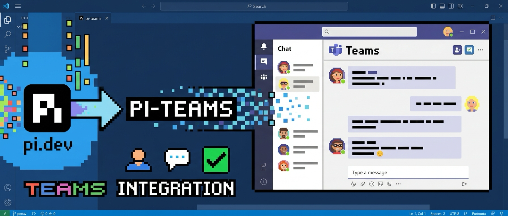

# pi-teams

Microsoft Teams integration for the [pi coding agent](https://github.com/earendil-works/pi).

pi acts **as you**: it reads what you can read, and anything it sends comes from
your account, in your name, in the right thread. Multiple Teams accounts and
multiple company tenants live side by side, and a configuration file decides
exactly which teams, channels, chats and people pi may touch.



## Installation

```bash
# From npm
pi install npm:@patimweb/pi-teams

# From a local checkout during development
pi install /path/to/pi-teams
```

## Quick start

1. **Register an app in Entra ID** — once per organization. Two settings decide
   whether sign-in works at all (a redirect URI and public client flows), so
   follow [docs/entra-app-registration.md](docs/entra-app-registration.md)
   rather than guessing from the portal.

2. **Configure the account:**

   ```
   teams_setup:
     name: work
     tenantId: contoso.onmicrosoft.com
     clientId: <application (client) ID>
     setDefault: true
   ```

3. **Sign in:** run `/teams-login`. Your browser opens at the Microsoft sign-in
   page and closes itself when you are done — nothing to type.

4. **Check it works:** `/teams-status`, then `/teams-inbox`.

If anything goes wrong, run `teams_doctor` before anything else: it checks the
configuration, the sign-in, which scopes were actually granted, and whether live
calls succeed, for every configured account.

## What it can do

Read and write chats and channel threads, search your Teams history, react to
and edit your own messages, download the files and pictures a message carries,
see who is available, and schedule, change or cancel meetings — across several
accounts and tenants at once. The full list is in
[docs/tools.md](docs/tools.md).

**Listen mode** is the one feature that acts without being asked: pi polls your
chats and answers incoming messages as you. It is off by default, never starts
on its own, and is worth reading about before switching on —
[docs/listen-mode.md](docs/listen-mode.md).

## Documentation

| Document | What it answers |
|----------|-----------------|
| [entra-app-registration.md](docs/entra-app-registration.md) | How do I register the app, and who has to approve which permission? |
| [sign-in.md](docs/sign-in.md) | How does pi sign in, where is the session kept, what happens on a headless machine? |
| [configuration.md](docs/configuration.md) | Every key in `pi-teams.json`: accounts, tenants, safety levels, scope rules, the AI footer. |
| [tools.md](docs/tools.md) | Every tool, command and prompt — and how to address a chat, a channel or a mention. |
| [listen-mode.md](docs/listen-mode.md) | How pi answers on its own, and how to keep that narrow. |
| [security.md](docs/security.md) | What pi may do in your name, what stops it, and what it writes to disk. |
| [troubleshooting.md](docs/troubleshooting.md) | A symptom-to-cause table, including the `AADSTS` codes. |
| [architecture.md](docs/architecture.md) | Module map and development setup, for contributing. |

The bundled skill (`skills/teams-collaboration/SKILL.md`) is documentation too,
but for the model rather than for you: it is what tells pi how to write a Teams
message, when to read before replying, and which tool fits a request.

## A note on what this is

pi sends messages that are indistinguishable from ones you typed. There is no
"sent by a bot" marker in Teams, which is why an AI disclosure footer is
appended by default and why the default safety level asks before every write.
Both are configurable; both are deliberate. See
[docs/security.md](docs/security.md) before you turn either off.

## License

MIT
